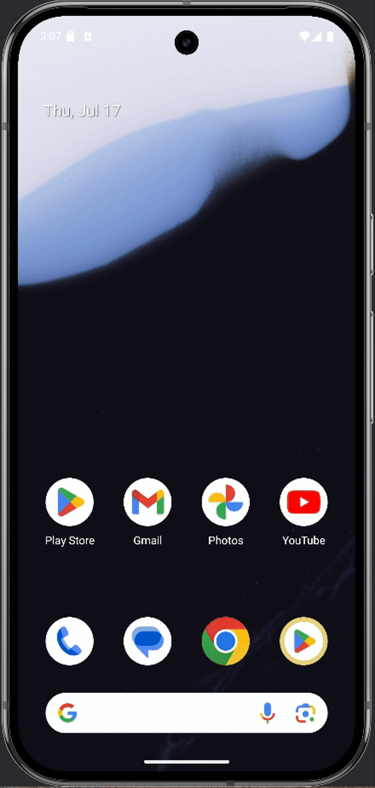

# 목차

1. [💡 프로젝트 소개](#프로젝트-소개)
2. [📝 프로젝트 후기](#프로젝트-후기)
3. [🗂️ ERD](#erd)
4. [👥 팀원](#팀원)
5. [🧠 핵심 기능](#핵심-기능)
6. [📏 API 문서](#api-문서)

# 프로젝트 소개

### 앱 설명

 
Tracky는 러닝 활동을 기반으로 한 소셜 피트니스 앱입니다.
 
Nike Run Club 앱을 벤치마킹 하여 제작하였습니다.

### 프로젝트 기간

    2025. 04. 11 ~ 2025. 05. 02

# 프로젝트 후기

- 이번 프로젝트를 진행하며 초기 설계의 중요성을 깊이 체감했습니다. 개발 초기에 화면에 필요한 데이터를 명확히 파악하지 못한 채 구현을 시작했고, 이로 인해 기능 구현 중에도 코드를 반복적으로 수정하고 추가하는
  상황이 발생했습니다. 이 과정에서 예상보다 많은 시간이 소요되었을 뿐만 아니라, 명확한 방향성 없이 작업을 반복하면서 코드 구조가 복잡해지고 전반적인 가독성까지 저하되는 결과를 낳았습니다.
  만약 개발 초기에 비즈니스 로직과 데이터 흐름을 충분히 고민하고, 어떤 데이터를 DTO(Data Transfer Object)에 어떻게 담아 반환할지 미리 설계했다면 불필요한 수정 횟수를 크게 줄이고 훨씬
  효율적으로 개발할 수 있었을 것입니다. 이번 경험을 통해 초기 설계와 비즈니스 요구사항에 대한 깊은 이해가 개발의 완성도, 속도, 그리고 코드 품질을 결정하는 핵심 요소임을 명확히 깨달았습니다.

- 평소 외부 API 연동에 대한 관심이 많았는데, 이번 프로젝트를 통해 OAuth 기반 카카오 로그인 기능을 직접 개발할 기회를 얻었습니다. 기능 구현 과정에서 여러 어려움에 직면하며 마감 기한이 다가왔고, 결국
  원활한 진행을 위해 부팀장님께 해당 작업을 인계하게 되었습니다. 기능이 거의 완성 단계에 이르렀음에도 불구하고 완전히 동작하지 않아 끝까지 직접 해결하고 싶은 마음이 컸습니다. 하지만 저의 고집이 전체 프로젝트
  일정에 부정적인 영향을 줄 수 있다는 판단하에 결단을 내렸습니다. 이번에 완벽히 구현하지 못한 OAuth 기능은 개인 시간을 활용하여 반드시 완성하고, 더 나아가 다양한 외부 API 연동 경험을 쌓을 계획입니다.

- 이번 프로젝트는 프론트엔드와 백엔드가 완전히 분리된 구조로 진행되었으며, 이는 협업의 중요성을 다시 한번 상기시켜 주었습니다. 프론트엔드에서 화면에 데이터를 정확하게 표시하기 위해 어떤 형식으로 데이터를 넘겨줘야
  할지 깊이 고민했습니다. 또한, API URL을 어떻게 설계해야 기능의 의도를 직관적으로 드러낼 수 있을지에 대해서도 많은 노력을 기울였습니다. 이 경험을 통해 주석이나 추가 설명 없이도 팀원들이 제 코드를 쉽게
  이해할 수 있어야 한다는 점과, 명확하고 일관된 API 설계가 협업 효율성을 극대화한다는 것을 체감할 수 있었습니다.

## 🛠️ 사용 기술

<table>
    <tr>
        <td align="center"> Java</td>
        <td align="center"> Spring Boot</td>
        <td align="center"> RestDoc</td>
        <td align="center"> JPA(Hibernate)</td>
        <td align="center"> H2</td>
        <td align="center"> MySQL</td>
    </tr>
</table>
<table>
    <tr>
        <td align="center"> FCM</td>
        <td align="center"> Kakao OIDC</td>
        <td align="center"> Github Action</td>
        <td align="center"> aws</td>
        <td align="center"> Sentry</td>
    </tr>
</table>

## 🤝 협업 도구

<table>
    <tr>
        <td align="center"> Git</td>
        <td align="center"> GitHub</td>
        <td align="center"> Notion</td>
        <td align="center"> Slack</td>
    </tr>
</table>

 

# ERD

# 팀원

| 이름  | 역할  | GitHub                                       |
|-----|-----|----------------------------------------------|
| 문정준 | 팀장  | [@Sxias](https://github.com/Sxias)           |
| 최재원 | 부팀장 | [@jjack-1](https://github.com/jjack-1)       |
| 편준민 | 팀원  | [@JunMin0529](https://github.com/JunMin0529) |
| 김세리 | 팀원  | [@roni243](https://github.com/roni243)       |

 

# 핵심 기능

### 공통

- 로그인, 회원가입
- 유효성 검사
- 인증 체크

### 러닝

- 러닝 기록 - 등록, 수정, 삭제
- 러닝 기록 - 통계 : 주간, 월간, 년간, 전체
- 러닝 기록 - 러닝레벨
- 러닝 기록 - 획득 뱃지 : 최고기록, 월간기록
- 러닝 기록 - 리더보드 : 친구들과의 누적거리 비교

### 챌린지

- 챌린지 - 등록, 수정, 삭제
- 챌린지 - 스케줄러 : 공개챌린지 생성 및 사설챌린지 보상
- 챌린지 - 보상목록
- 챌린지 - 리더보드 : 챌린지 참가자들의 누적거리 비교
- 챌린지 - 초대 : 사설챌린지에 친구를 초대할 수 있음

### 게시글

- 게시글 - 등록, 수정, 삭제
    - 게시글에 러닝 기록을 등록할 수 있음
- 댓글 - 등록, 수정, 삭제
- 좋아요 - 등록, 삭제

# API 문서

[API 문서 보러가기](https://junmin0529.github.io/tracky-spring/api.html)
